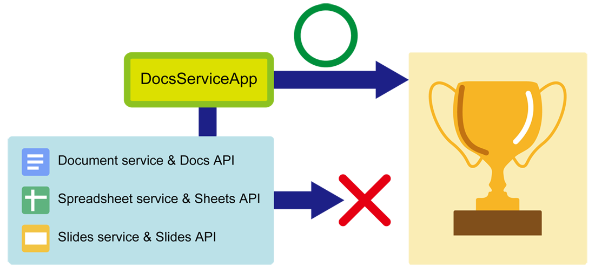
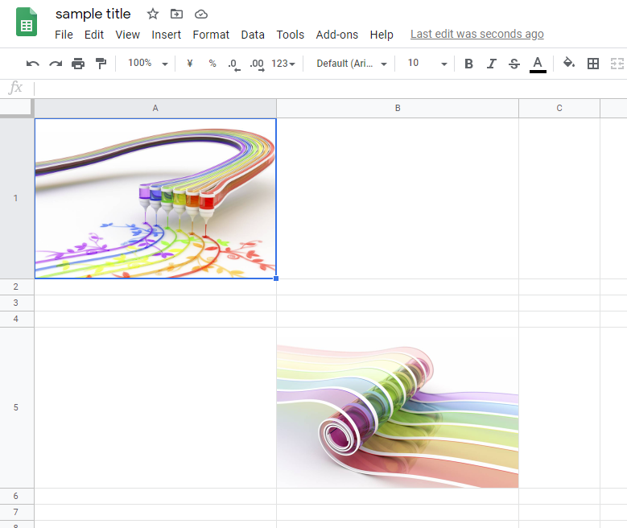
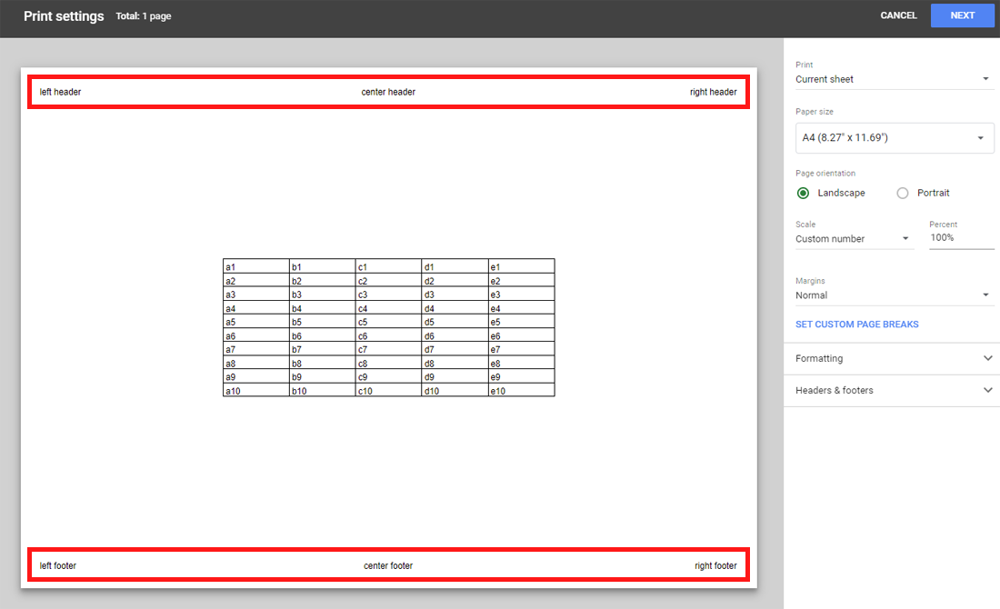
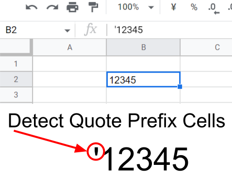
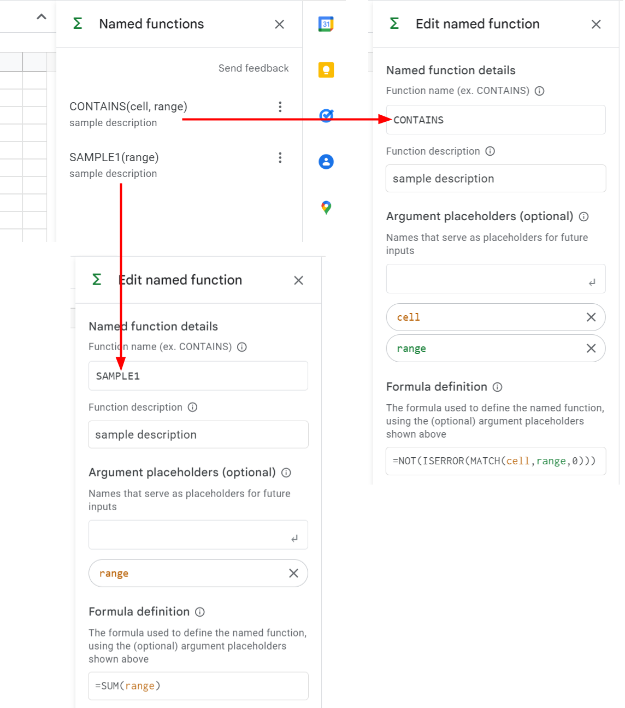
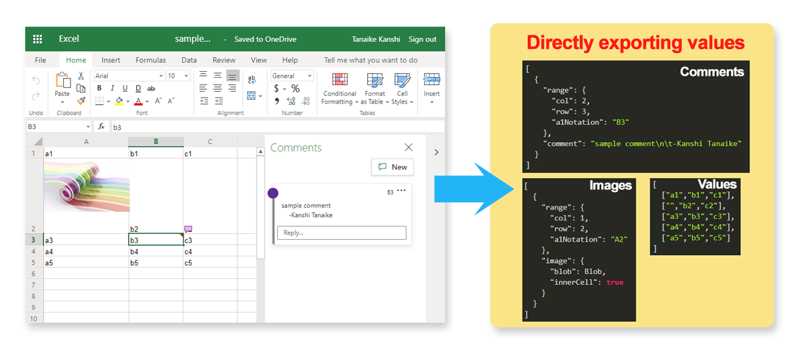

# DocsServiceApp

<a name="top"></a>

[](LICENCE)

<a name="overview"></a>

# Overview

**This is a Google Apps Script library for supporting Document service, Docs API, Spreadsheet service, Sheets API, Slides service and Slides API.** The aim of this library is to compensate the processes that they services cannot achieve.



<a name="description"></a>

# Description

The Google services, which are Document service, Docs API, Spreadsheet service, Sheets API, Slides service and Slides API, are growing now. But, unfortunately, there are still the processes that they cannot done. I created this GAS library for supporting the Google services.

The basic method of DocsServiceApp is to directly create and edit the data of Microsoft Docs (Word, Excel and Powerpoint). The created data of Microsoft Docs can be reflected to Google Docs (Document, Spreadsheet and Slides) by converting and copying the values. By this, the processes which cannot be achieved by Google services are achieved. So it can be considered that this DocsServiceApp is used as the wrapper for supporting Google service. I believe that this method will be able to be also applied for various scenes as the methodology. So I would like to grow this library.

# Feature

## For Google Docs

### [Google Document](#googledocument)

- Retrieve table width and column width from the table. The tables inserted with the default width are included.

### [Google Spreadsheet](#googlespreadsheet)

- Retrieve all images in Google Spreadsheet as an object including the cell range and image blob.
- Retrieve all comments in Google Spreadsheet as an object including the cell range and comments.
- Insert images in cells of Google Spreadsheet using the image blob.
- Create new Google Spreadsheet by setting the custom header and footer.
- Retrieve cell coordinates of cells with the quote prefix.
- Retrieve named functions.

### [Google Slides](#googleslides)

- Create new Google Slides by setting the page size.

## For Microsoft Docs

In the current stage, there are not methods for directly parsing Microsoft Docs files. This library can achieve this.

### [Microsoft Word](#microsoftword)

- Retrieve table width and column width.

### [Microsoft Excel](#microsoftexcel)

- Retrieve all values and formulas of the cells.
- Retrieve all sheet names.
- Retrieve all images as an object including the cell range and image blob.
- Retrieve all comments as an object including the cell range and comments.

### [Microsoft Powerpoint](#microsoftpowerpoint)

There are no methods yet.

# Library's project key

```
108j6x_ZX544wEhGkgddFYM6Ie09edDqXaFwnW3RVFQCLHw_mEueqUHTW
```

# How to install

## Install this library

- Open Script Editor. Click as follows:
- -> Resource
- -> Library
- -> Input the Script ID in the text box. The Script ID is **`108j6x_ZX544wEhGkgddFYM6Ie09edDqXaFwnW3RVFQCLHw_mEueqUHTW`**.
- -> Add library
- -> Please select the latest version
- -> Developer mode ON (Or select others if you don't want to use the latest version)
- -> The identifier is "**`DocsServiceApp`**". This is set under the default.

[You can read more about libraries in Apps Script here](https://developers.google.com/apps-script/guide_libraries).

Please use this library with enabling V8 runtime.

## About Google APIs

This library uses the following Google APIs. So when you want to use the library, please enable the following APIs at Advanced Google services. [Ref](https://developers.google.com/apps-script/guides/services/advanced#enabling_advanced_services)

- Drive API: This is used for all methods.
- Sheets API: This is used for Google Spreadsheet.

## About scopes

This library uses the following scope. This is installed in the library, and nothing further is required from the user. But if you want to manually control the scopes, please set the required scopes to the manifest file (`appsscript.json`) in your client Google Apps Script project.

- `https://www.googleapis.com/auth/drive`
  - This is used for all methods.
- `https://www.googleapis.com/auth/script.external_request`
  - This is used for all methods.
- `https://www.googleapis.com/auth/documents`
  - This is used for Google Document.
- `https://www.googleapis.com/auth/spreadsheets`
  - This is used for Google Spreadsheet.
- `https://www.googleapis.com/auth/presentations`
  - This is used for Google Slides.

## About including GAS libraries

This library uses the following Google Apps Script library.

- [ImgApp](https://github.com/tanaikech/ImgApp)

<a name="methods"></a>

# Methods

In the current stage, there are the following methods in this library.

<a name="googledocument"></a>

## For Google Document

### 1. `getTableColumnWidth()`

Retrieve the column width of the table in the Google Document. For example, when a new table, which has 1 row and 2 columns, is manually inserted to the Document body as the default format, the table width and column width retrieved by `getColumnWidth()` return `null`. By this, in the current stage, the table width and column width cannot be retrieved. This method achieves this.

#### Sample script

```javascript
const documentId = "###"; // Google Document ID
const res = DocsServiceApp.openByDocumentId(documentId).getTableColumnWidth();
console.log(res);
```

#### Result

```json
[
  {
    "tableIndex": 0, // 0 means the 1st table in Google Document.
    "unit": "pt",
    "tableWidth": 451.3, // Table width
    "tebleColumnWidth": [225.65, 225.65] // Column width of each column. Array index is the column index.
  },
  ,
  ,
  ,
]
```

- For example, when the table which has the columns "A" and "B" of 100 pt and 200 pt are checked by above script, the same values of 100 and 200 for the columns "A" and "B" could be confirmed. So from this result, it is found that the column width of DOCX data and Google Document is the same.

<a name="googlespreadsheet"></a>

## For Google Spreadsheet

### 1. `getImages()`

Retrieve images in and over the cell from Google Spreadsheet as blob. In the current stage, there are no methods for retrieving the images over the cells and inner the cells in the existing Google Spreadsheet service and Sheets API. This method achieves this.

#### Sample script

```javascript
const spreadsheetId = "###"; // Google Spreadsheet ID
const res = DocsServiceApp.openBySpreadsheetId(spreadsheetId)
  .getSheetByName("Sheet1")
  .getImages();
console.log(res);
```

In this script, the images are retrieved from "Sheet1" of `spreadsheetId`.

And

```javascript
const spreadsheetId = "###"; // Google Spreadsheet ID
const res = DocsServiceApp.openBySpreadsheetId(spreadsheetId).getImages();
console.log(res);
```

In this script, the images are retrieved from all sheets of `spreadsheetId`.

When you want to save all images in the Spreadsheet as the files, you can use the following script.

```javascript
const spreadsheetId = "###"; // Google Spreadsheet ID
const res = DocsServiceApp.openBySpreadsheetId(spreadsheetId).getImages();
const folder = DriveApp.getFolderById("### folderId ###");
res.forEach(({ images }) =>
  images.forEach((e) => {
    if (e.image) folder.createFile(e.image.blob);
  })
);
```

#### Result

```json
[
  {
    "range": { "col": 3, "row": 8, "a1Notation": "C8" },
    "image": {
      "description": "sample description",
      "title": "sample title",
      "blob": BLOB,
      "innerCell": false // "false" means that the image is over a cell.
    }
  },
  {
    "range": { "col": 2, "row": 2, "a1Notation": "B2" },
    "image": {
      "description": "sample description",
      "title": "sample title",
      "blob": BLOB,
      "innerCell": true // "true" means that the image is in a cell.
    }
  },
  ,
  ,
  ,
]
```

- You can create the image file from `BLOB`.

- When `getSheetByName()` is not used, above array is put in each sheet as follows.

  ```json
  [
    { "sheetName": "Sheet1", "images": [[Object], [Object], [Object]] },
    { "sheetName": "Sheet2", "images": [] },
    { "sheetName": "Sheet3", "images": [[Object], [Object]] }
  ]
  ```

#### Limitation

- When the images are retrieved from XLSX data, it seems that the image is a bit different from the original one. The image format is the same. But the data size is smaller than that of the original. When the image size is more than 2048 pixels and 72 dpi, the image is modified to 2048 pixels and 72 dpi. Even when the image size is less than 2048 pixels and 72 dpi, the file size becomes smaller than that of original one. So I think that the image might be compressed. Please be careful this.
- In the current stage, the drawings cannot be retrieved yet. I apologize for this.

### 2. `getComments()`

Retrieve comments in Google Spreadsheet. In the current stage, there are no methods for retrieving the comments with the cell coordinate in the existing Google Spreadsheet service and Sheets API. This method achieves this.

#### Sample script

```javascript
const spreadsheetId = "###"; // Google Spreadsheet ID
const res = DocsServiceApp.openBySpreadsheetId(spreadsheetId)
  .getSheetByName("Sheet1")
  .getComments();
console.log(res);
```

In this script, the images are retrieved from "Sheet1" of `spreadsheetId`.

And

```javascript
const spreadsheetId = "###"; // Google Spreadsheet ID
const res = DocsServiceApp.openBySpreadsheetId(spreadsheetId).getComments();
console.log(res);
```

In this script, the images are retrieved from all sheets of `spreadsheetId`.

#### Result

```json
[
  {
    "range": {
      "col": 2,
      "row": 11,
      "a1Notation": "B11"
    },
    "comment": [
      {
        "user": "user name",
        "comment": "comment"
      },
      ,
      ,
      ,
    ]
  },
  ,
  ,
  ,
]
```

- When `getSheetByName()` is not used, above array is put in each sheet as follows.

  ```json
  [
    { "sheetName": "Sheet1", "images": [[Object], [Object], [Object]] },
    { "sheetName": "Sheet2", "images": [] },
    { "sheetName": "Sheet3", "images": [[Object], [Object]] }
  ]
  ```

### 3. `insertImage()`

Insert images in and over the cell from Google Spreadsheet from the image blob. In the current stage, there are no methods for directly inserting an image in a cell in the existing Google Spreadsheet service and Sheets API. For example, when the user wants to insert an image on own Google Drive in a cell, the image is required to be publicly shared for using `=IMAGE(URL)`. In this method, the image can be put without publicly sharing the image and using `=IMAGE(URL)`.

#### Sample script

```javascript
const spreadsheetId = "###"; // Google Spreadsheet ID
const blob1 = DriveApp.getFileById("###fileId###").getBlob();
const blob2 = UrlFetchApp.fetch("###URL###").getBlob();
const object = [
  { blob: blob1, range: { row: 1, column: 1 } }, // Image is inserted in a cell "A1".
  { blob: blob2, range: { row: 5, column: 2 } }, // Image is inserted in a cell "B5".
];
DocsServiceApp.openBySpreadsheetId(spreadsheetId)
  .getSheetByName("Sheet1")
  .insertImage(object);
```

- **In this method, no values are returned.**
- In above sample script, 2 images are inserted into the cells "A1" and "B5" in "Sheet1", respectively.

#### Result



- The sample image of cell "A1" is from [https://www.deviantart.com/k3-studio/art/Rainbow-painting-281090729](https://www.deviantart.com/k3-studio/art/Rainbow-painting-281090729)
- The sample image of cell "B5" is from [https://www.deviantart.com/k3-studio/art/Chromatic-lituus-415318548](https://www.deviantart.com/k3-studio/art/Chromatic-lituus-415318548)

#### Limitation

- When the images are retrieved from XLSX data, it seems that the image is a bit different from the original one. The image format is the same. But the data size is smaller than that of the original. When the image size is more than 2048 pixels and 72 dpi, the image is modified to 2048 pixels and 72 dpi. Even when the image size is less than 2048 pixels and 72 dpi, the file size becomes smaller than that of original one. So I think that the image might be compressed. Please be careful this.
- In the current stage, the drawings cannot be retrieved yet. I apologize for this.

### 4. `createNewSpreadsheetWithCustomHeaderFooter()`

Create new Google Spreadsheet by setting the header and footer. In the current stage, there are no methods for setting the header and footer for Google Spreadsheet in the existing Google Spreadsheet service and Sheets API. This method achieves this.

#### Sample script

```javascript
const object = {
  title: "sample title", // Title of created Spreadsheet.
  parent: "###", // folder ID
  header: { l: "left header", c: "center header", r: "right header" },
  footer: { l: "left footer", c: "center footer", r: "right footer" },
};
const res = DocsServiceApp.createNewSpreadsheetWithCustomHeaderFooter(object);
console.log(res);
```

- In this method, the spreadsheet ID of created Spreadsheet is returned.

#### Result



<a name="getQuotePrefixCells"></a>

### 5. `getQuotePrefixCells()`



Retrieve cell coordinates of cells with the quote prefix. In Google Spreadsheet, when a single quote is add to the top letter of the cell value, the cell is used as the text value. When we want to search the cells with the quote prefix in Spreadsheet, unfortunately, in the current stage, this cannot be achieved using Spreadsheet service (SpreadsheetApp) and Sheets API. In this method, such cells can be retrieved. The output values are the cell coordinates of the cells with the quote prefix.

#### Sample script

```javascript
const spreadsheetId = "###"; // Google Spreadsheet ID
const res = DocsServiceApp.openBySpreadsheetId(spreadsheetId)
  .getSheetByName("Sheet1") // Please set sheet name.
  .getQuotePrefixCells();
console.log(res);
```

#### Result

```json
["A1", "C3", "E1", , ,]
```

- I answered this method to [this thread at Stackoverflow](https://stackoverflow.com/a/73616511).

<a name="getnamedfunctions"></a>

### 6. `getNamedFunctions()`



This method is for retrieving the named functions from Google Spreadsheet using Google Apps Script.

Recently, the named functions got to be able to be used in Google Spreadsheet. [Ref](https://workspaceupdates.googleblog.com/2022/08/named-functions-google-sheets.html) When several named functions are added, I thought that I wanted to retrieve these functions using a script. But, unfortunately, in the current stage, it seems that there are no built-in methods (SpreadsheetApp and Sheets API) for directly retrieving the named functions. So, I created this method.

#### Sample script

```javascript
const spreadsheetId = "###"; // Google Spreadsheet ID
const res =
  DocsServiceApp.openBySpreadsheetId(spreadsheetId).getNamedFunctions();
console.log(res);
```

#### Result

When this script is run to the top sample situation in this section, the following result is obtained.

```json
[
  {
    "definedName": "CONTAINS",
    "definedFunction": "LAMBDA(cell, range, NOT(ISERROR(MATCH(cell,range,0))))"
  },
  { "definedName": "SAMPLE1", "definedFunction": "LAMBDA(range, SUM(range))" }
]
```

- Unfortunately, in the current stage, the description of the named function cannot be obtained.

- At XLSX format, the named functions are used as LAMBDA function. If you want to directly use this LAMBDA function, for example, please put a function like =LAMBDA(range, SUM(range))(A1:A5) into a cell. By this, the LAMBDA function can be run. Of course, you can retrieve the function from this result and put it as the named function again.

- I posted this method in my [blog](https://tanaikech.github.io/2022/09/28/retrieving-named-functions-from-google-spreadsheet-using-google-apps-script/).

<a name="googleslides"></a>

## For Google Slides

### 1. `createNewSlidesWithPageSize()`

Create new Google Slides by setting the page size. In the current stage, there are no methods for setting the page size for Google Slides in the existing Google Slides service and Slides API, although Slides API has the method of "presentations.create". This method achieves this.

#### Sample script

```javascript
const object = {
  title: "sample title", // Title of created Slides.
  parent: "###", // folder ID
  width: { unit: "pixel", size: 200 },
  height: { unit: "pixel", size: 300 },
};
const res = DocsServiceApp.createNewSlidesWithPageSize(object);
console.log(res);
```

- In this method, the presentation ID of created Slides is returned.
- "pixel" and "point" can be used for `unit` in above object.

#### Sample situations

When this method is used, the following application can be created.

1. [Inserting Text on Image using Google Apps Script](https://gist.github.com/tanaikech/835642df109731a559e52d831bd3342d) : This is a sample script for inserting a text on an image using Google Apps Script.

<a name="microsoftword"></a>

## For Microsoft Word

### 1. `getTableColumnWidth()`

Retrieve the column width of the table in the Microsoft Word. In this case, the column width of the table are directly retrieved from Microsoft Word.

#### Sample script

```javascript
const blob = "BLOB"; // Blob of Microsoft Word file.
const res = DocsServiceApp.openByWordFileBlob(blob).getTableColumnWidth();
console.log(res);
```

#### Result

```json
[
  {
    "tableIndex": 0, // 0 means the 1st table in Google Document.
    "unit": "pt",
    "tableWidth": 451.3, // Table width
    "tebleColumnWidth": [225.65, 225.65] // Column width of each column. Array index is the column index.
  },
  ,
  ,
  ,
]
```

<a name="microsoftexcel"></a>

## For Microsoft Excel



> IMPORTANT: About `getValues()` and `getFormulas()` methods, in the current stage, the process costs of them is much higher than those of Google Spreadsheet service. So when you want to retrieve the values and formulas from XLSX data, I would like to recommend to use Google Spreadsheet service by converting XSLX data to Google Spreadsheet.

### 1. `getImages()`

Retrieve images in and over the cell from Microsoft Excel as blob. In this case, the images are directly retrieved from Microsoft Excel.

#### Sample script

```javascript
const blob = "BLOB"; // Blob of Microsoft Excel file.
const res = DocsServiceApp.openByExcelFileBlob(blob)
  .getSheetByName("Sheet1")
  .getImages();
console.log(res);
```

In this script, the images are retrieved from "Sheet1" of `spreadsheetId`.

And

```javascript
const blob = "BLOB"; // Blob of Microsoft Excel file.
const res = DocsServiceApp.openByExcelFileBlob(blob).getImages();
console.log(res);
```

In this script, the images are retrieved from all sheets of `spreadsheetId`.

- **`blob`** : Blob of XLSX file.
- **`sheetName`** : Sheet name in XLSX file. The formulas are retrieved from the sheet.

#### Result

```json
[
  {
    "range": { "col": 3, "row": 8, "a1Notation": "C8" },
    "image": {
      "description": "sample description",
      "title": "sample title",
      "blob": BLOB,
      "innerCell": false // "false" means that the image is over a cell.
    }
  },
  {
    "range": { "col": 2, "row": 2, "a1Notation": "B2" },
    "image": {
      "description": "sample description",
      "title": "sample title",
      "blob": BLOB,
      "innerCell": true // "true" means that the image is in a cell.
    }
  },
  ,
  ,
  ,
]
```

- When `getSheetByName()` is not used, above array is put in each sheet as follows.

  ```json
  [
    { "sheetName": "Sheet1", "images": [[Object], [Object], [Object]] },
    { "sheetName": "Sheet2", "images": [] },
    { "sheetName": "Sheet3", "images": [[Object], [Object]] }
  ]
  ```

#### Limitation

- When the images are retrieved from XLSX data, it seems that the image is a bit different from the original one. The image format is the same. But the data size is smaller than that of the original. When the image size is more than 2048 pixels and 72 dpi, the image is modified to 2048 pixels and 72 dpi. Even when the image size is less than 2048 pixels and 72 dpi, the file size becomes smaller than that of original one. So I think that the image might be compressed. Please be careful this.
- In the current stage, the drawings cannot be retrieved yet. I apologize for this.

### 2. `getComments()`

Retrieve comments in Microsoft Excel. In this case, the comments are directly retrieved from Microsoft Excel.

#### Sample script

```javascript
const blob = "BLOB"; // Blob of Microsoft Excel file.
const res = DocsServiceApp.openByExcelFileBlob(blob)
  .getSheetByName("Sheet1")
  .getComments();
console.log(res);
```

In this script, the comments are retrieved from "Sheet1" of Blob of Microsoft Excel file.

- **`blob`** : Blob of XLSX file.
- **`sheetName`** : Sheet name in XLSX file. The formulas are retrieved from the sheet.

#### Result

```json
[
  {
    "range": {
      "col": 2,
      "row": 11,
      "a1Notation": "B11"
    },
    "comment": [
      {
        "user": "user name",
        "comment": "comment"
      },
      ,
      ,
      ,
    ]
  },
  ,
  ,
  ,
]
```

### 3. `getAll()`

This method is used for retrieving all values (in the current stage, those are values, formulas, images and comments.) from all sheets of XLSX data. The returned value is JSON object.

#### Sample script

```javascript
function myFunction() {
  const fileId = "###"; // Please set the file ID of XLSX file.
  const blob = DriveApp.getFileById(fileId).getBlob();

  const res = DocsServiceApp.openByExcelFileBlob(blob).getAll();
  console.log(res);
}
```

- **`blob`** : Blob of XLSX file.
- The values are returned as JSON object. The returned values include the values, formulas, images and comments of all sheets in the XLSX data.

### 4. `getSheets()`

This method is used for retrieving the sheet list from XLSX data.

#### Sample script

```javascript
function myFunction() {
  const fileId = "###"; // Please set the file ID of XLSX file.
  const blob = DriveApp.getFileById(fileId).getBlob();

  const res = DocsServiceApp.openByExcelFileBlob(blob).getSheets();
  console.log(res);
}
```

- **`blob`** : Blob of XLSX file.

### 5. `getValues()`

This method is used for updating the values from a sheet of XLSX data.

#### Sample script

```javascript
function myFunction() {
  const fileId = "###"; // Please set the file ID of XLSX file.
  const sheetName = "###"; // Please set the sheet name.
  const blob = DriveApp.getFileById(fileId).getBlob();

  const res = DocsServiceApp.openByExcelFileBlob(blob)
    .getSheetByName(sheetName)
    .getValues();
  console.log(res);
}
```

- **`blob`** : Blob of XLSX file.
- **`sheetName`** : Sheet name in XLSX file. The values are retrieved from the sheet.

Sample result value is as follows. The values are returned as 2 dimensional array.

```json
[
  ["a1", "b1", "c1"],
  ["", "b2", "c2"],
  ["a3", "b3", "c3"],
  ["a4", "b4", "c4"],
  ["a5", "b5", "c5"]
]
```

<a name="getformulas"></a>

### 6. `getFormulas()`

This method is used for updating the formulas from a sheet of XLSX data.

### Sample script

```javascript
function myFunction() {
  const fileId = "###"; // Please set the file ID of XLSX file.
  const sheetName = "###"; // Please set the sheet name.
  const blob = DriveApp.getFileById(fileId).getBlob();

  const res = DocsServiceApp.openByExcelFileBlob(blob)
    .getSheetByName(sheetName)
    .getFormulas();
  console.log(res);
}
```

- **`blob`** : Blob of XLSX file.
- **`sheetName`** : Sheet name in XLSX file. The formulas are retrieved from the sheet.
- The values are returned as 2 dimensional array.

<a name="microsoftpowerpoint"></a>

## For Microsoft Powerpoint

There are no methods yet.

---

<a name="licence"></a>

# Licence

[MIT](LICENCE)

<a name="author"></a>

# Author

[Tanaike](https://tanaikech.github.io/about/)

<a name="updatehistory"></a>

# Update History

- v1.0.0 (September 24, 2020)

  1. Initial release.

- v1.1.0 (September 28, 2022)

  1. Added a new method of [`getQuotePrefixCells()`](#getQuotePrefixCells). This method can detect the cells with the quote prefix cells.

- v1.2.0 (September 29, 2022)

  1. Added a new method of [`getNamedFunctions()`](#getnamedfunctions). This method can retrieve the named functions from Google Spreadsheet.

- v1.2.1 (December 28, 2022)

  1. Remove a bug in `ExcelApp`.

- v1.2.2 (January 30, 2024)

  1. Remove a bug in `ExcelApp`. When the inserted image had no data, an error occurred. This issue was removed.

[TOP](#top)
